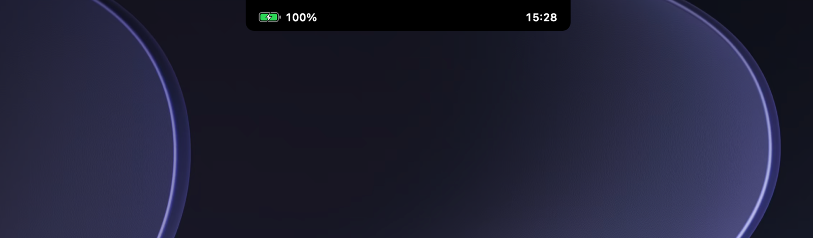
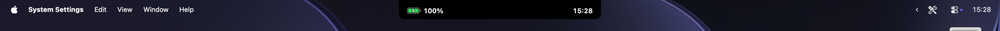

# Info Notch

Widens your MacBook's notch into a seamless black bar with **battery on the left** and **the time on the right**. Always on, tiny, and built into the menu bar.




## Features
- Battery percentage + icon that fills with charge level (green with a bolt when plugged in, red at 20% or less)
- 24-hour clock
- ~35 MB RAM. Pure AppKit (no SwiftUI), battery updates are event-driven (no polling), the clock wakes once a minute
- No Dock icon, ignores clicks, shows on every Space
- Sized from the screen's real notch measurements

## Requirements
- A MacBook with a notch, macOS 14+
- Xcode or Command Line Tools (`xcode-select --install`)

## Build & run
```sh
git clone https://github.com/curvsystems/info-notch.git
cd info-notch
./build.sh
./infonotch &
```
Stop it with `pkill infonotch`.

## Start at login
```sh
./login.sh on    # installs a LaunchAgent, starts now and at every login
./login.sh off   # removes it
```
While it's on, the app restarts if killed; use `./login.sh off` to stop it for good.

## Customise
Edit the top of `main.swift`:
- `sideWidth`: how far the bar extends past each side of the notch (default 90pt)
- Clock format: change `"HH:mm"` to `"h:mm"` for 12-hour

> The wider bar covers whatever menu-bar items sit right next to the notch. Lower `sideWidth` if that bites.

## Notes
- Runs at window level `.statusBar`. It's designed to sit beneath other notch apps such as [Notchy](https://github.com/adamlyttleapps/notchy), which draw at the same level but on top; layering between apps at the same level is not guaranteed.
- Not yet included: multiple displays.

## License
MIT
